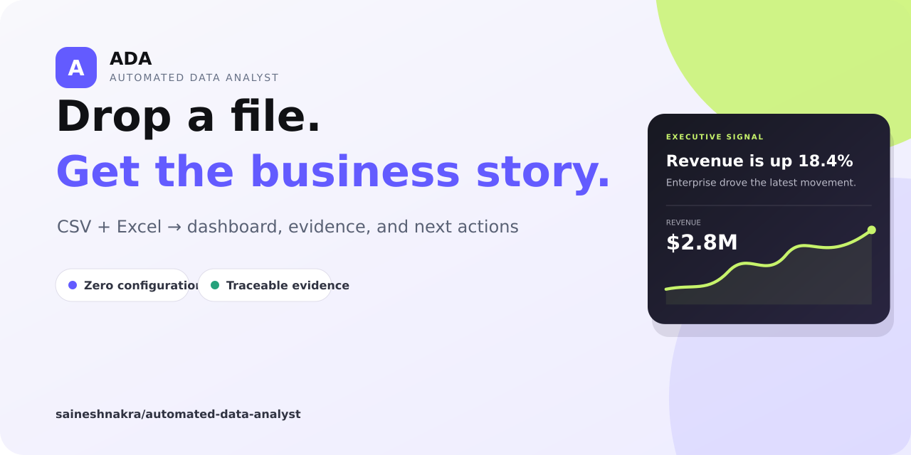
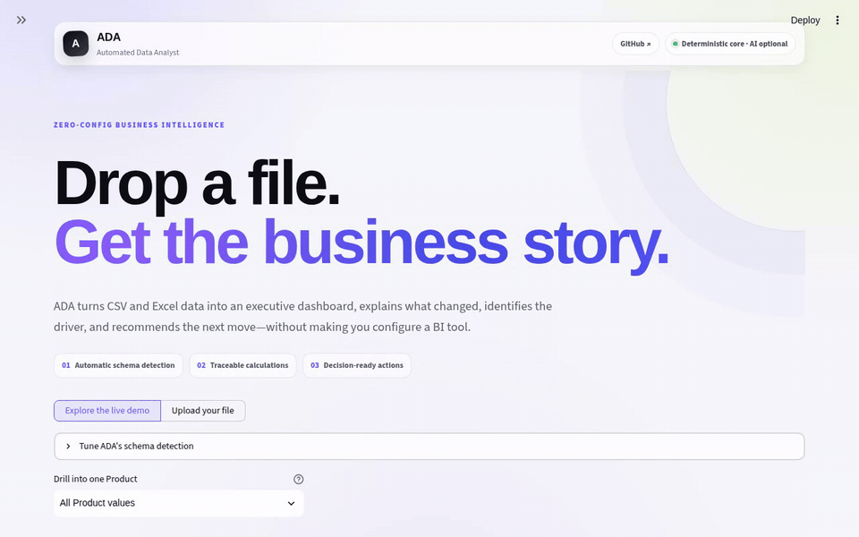
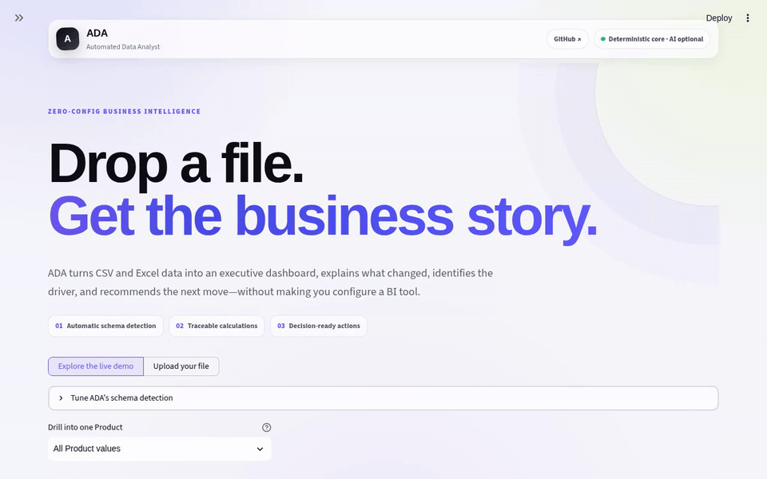
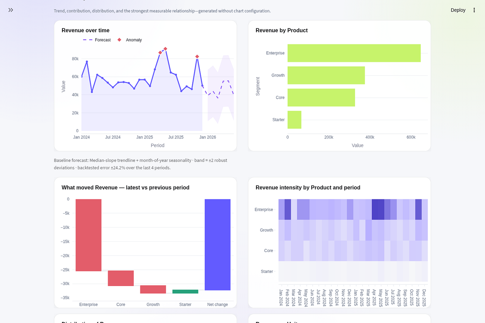
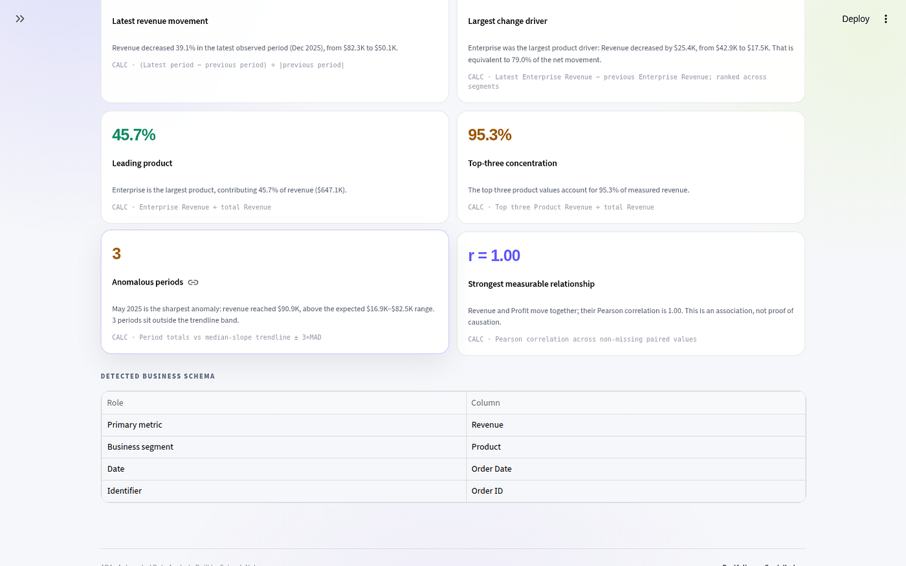
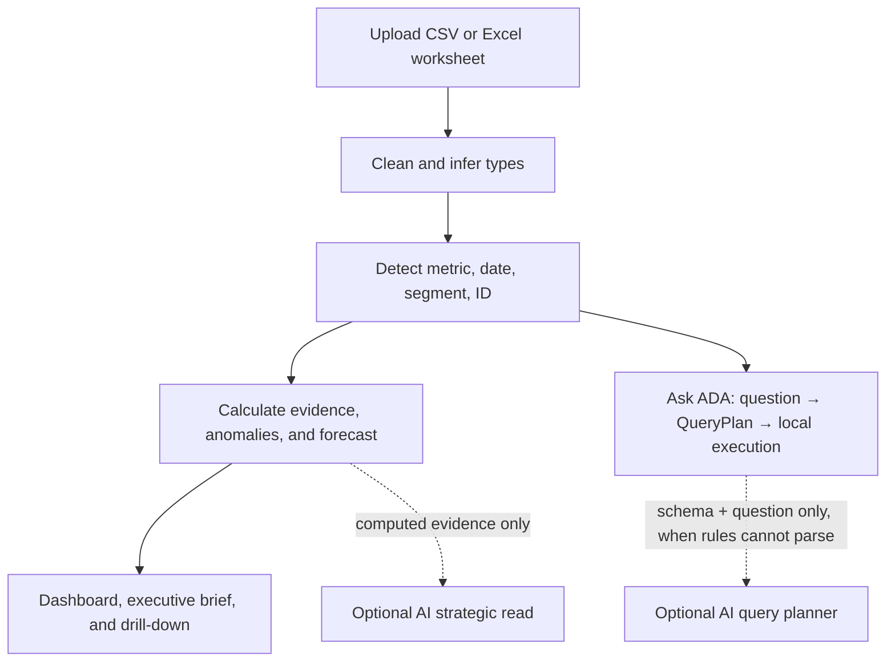

# ADA — AI-powered business intelligence from CSV and Excel

[](https://github.com/saineshnakra/automated-data-analyst/actions/workflows/ci.yml)
[](https://automated-data-analyst.streamlit.app/)
[](https://www.python.org/)
[](LICENSE)
[](CONTRIBUTING.md)

**Drop in a business file. Get a dashboard, the evidence behind it, and the next action.**

[Try the live dashboard](https://automated-data-analyst.streamlit.app/) · [Read the engineering story](https://medium.com/@saineshnakra/i-built-an-ai-data-analyst-that-tells-you-when-it-hallucinates-6051609c3f4a) · [See the roadmap](ROADMAP.md) · [Contribute](CONTRIBUTING.md) · [Report a bug](https://github.com/saineshnakra/automated-data-analyst/issues/new?template=bug_report.yml)



ADA is an open-source automated data analyst for operators who need answers without configuring a BI tool. Upload a CSV, XLSX, or XLSM file and ADA cleans it, detects its business schema, creates an interactive Plotly dashboard, flags anomalous periods, projects a guarded baseline forecast, explains material changes, recommends what to investigate next — and answers plain-English questions about the data with the calculation behind every reply.

It is designed for the simple use case analytics software often makes difficult: **even a first-time user should be able to upload a spreadsheet and understand what is happening in the business.**

## See ADA in action

### Ask a business question. Get the number and its calculation.



### Focus on one segment. Watch the entire analysis regroup itself.



<p align="center">
  
  
</p>

<p align="center"><sub>Anomalies, forecasts, drivers, and evidence stay inspectable instead of disappearing behind generated prose.</sub></p>

For the architecture, tradeoffs, and failure modes behind the product, read [**I Built an AI Data Analyst That Tells You When It Hallucinates**](https://medium.com/@saineshnakra/i-built-an-ai-data-analyst-that-tells-you-when-it-hallucinates-6051609c3f4a).

## Why ADA is different

Most CSV analyzers stop at charts. ADA keeps four layers explicit:

| Layer | What it does | Trust boundary |
|---|---|---|
| **Calculation** | Detects trends, drivers, anomalies, concentration, relationships, exceptions, and data quality | Deterministic and traceable |
| **Conversation** | Turns plain-English questions into auditable pandas query plans executed locally | Every answer shows its math |
| **Interpretation** | Turns calculations into prioritized investigations | Clearly labeled; never causal proof |
| **Optional AI** | Plans queries the rules cannot read and writes a strategic read over computed evidence | Opt-in; raw uploaded rows are never sent |

Every evidence card and chat answer exposes its calculation. The deterministic product remains authoritative whether or not a model is configured.

### How ADA compares

| | Chat-with-CSV AI tools | Traditional BI | **ADA** |
|---|---|---|---|
| Setup | Upload and prompt | Data modeling, weeks | Upload only |
| Answers | Plausible prose; reasoning hidden | Exact, but you build every chart | Deterministic calculations with the math shown |
| Rows sent to a model | Usually | Depends on vendor | Never — optional AI sees schema and evidence only |
| Anomalies and forecasts | On request, unverifiable | Paid add-ons | Built in, with a backtested error you can read |
| Cost | Subscription | License | Free and MIT-licensed |

## From spreadsheet to decision



ADA automatically looks for:

- A primary outcome such as revenue, sales, profit, cost, amount, or units
- A time field for period movement, anomaly detection, and the baseline forecast
- A useful segment such as product, category, channel, region, customer, or status
- Identifiers, missingness, outliers, concentration, and numeric relationships
- The strongest evidence-backed next investigation, separated from observed fact

If the source schema is unusual, users can override the detected metric, date, and segment without rebuilding the dashboard — and drill the whole analysis into a single segment slice.

## Product capabilities

- Zero-configuration CSV and Excel analytics with an included synthetic demo
- **Ask ADA**: plain-English questions (totals, rankings, breakdowns, trends, growth, counts, time and segment filters) answered locally with the calculation shown
- Anomaly radar: periods outside a robust trendline band are flagged on the chart, in the evidence ledger, and in the recommended actions
- Guarded baseline forecast with month-of-year seasonality, an uncertainty band, and its backtested error printed next to the chart
- Drill-down focus: analyze one segment value and automatically regroup by the next useful dimension
- Movement waterfall reconciling the latest change by segment, plus a segment-by-period intensity heatmap
- Worksheet picker for multi-sheet Excel workbooks
- Conservative cleanup, type inference, duplicate removal, and a visible cleaning audit
- Executive headline, four business KPIs, and plain-English briefing
- Evidence ledger with the calculation behind every displayed signal
- Prioritized recommendations linked to deterministic evidence
- Optional AI query planner and structured strategy synthesis using the OpenAI Responses API
- Downloadable Markdown executive brief and cleaned CSV
- Responsive Streamlit interface built for non-technical users
- File limit and row cap for predictable hosted performance

## Privacy and model design

ADA works fully without an API key. In deterministic mode, no model call is made — including every Ask ADA answer the rule-based parser can plan itself.

When a key is present, two narrow model calls become available, both typed and executed against the same local engine:

- **Query planner** — used only when the deterministic parser cannot read a question. It receives the column schema (names, types, roles) and the question itself, emits a typed `QueryPlan`, and ADA executes that plan locally. Unresolvable plans are refused rather than guessed, and AI-planned answers are visibly badged.
- **Strategic read** — receives only the calculated schema, summaries, evidence cards, recommendations, and user-supplied context.

**Neither call puts uploaded rows or cell values into the model prompt.** Responses must match a typed Pydantic schema, storage is disabled for the request, and a hashed anonymous session identifier is used for safety controls.

The default model is `gpt-5.6-luna` with low reasoning for an efficient strategic read. `gpt-5.6-terra` with medium reasoning is available when the decision is ambiguous enough to justify higher cost. Model calls are button-triggered and cached per evidence payload to avoid accidental spend.

See [SECURITY.md](SECURITY.md) for the complete data-handling and secret-management policy.

## Architecture

| Path | Responsibility |
|---|---|
| `app.py` | Thin Streamlit orchestration and session state |
| `pipeline.py` | Bounded preparation, cleaning, schema selection, drill-down, and audit frames |
| `analysis.py` | Conservative cleaning and data profiling |
| `business_insights.py` | Schema detection, calculations, evidence, and deterministic recommendations |
| `nlq.py` | Natural-language questions → auditable query plans → local execution |
| `anomalies.py` | Robust trendline anomaly detection over period aggregates |
| `forecasting.py` | Guarded baseline forecast with seasonality and a visible backtest |
| `ai_insights.py` | Optional typed Responses API query planning and evidence synthesis |
| `ui.py` | Reusable presentation components and Plotly styling |
| `file_io.py` | Validated CSV and Excel parsing with worksheet selection |
| `tests/` | Unit, privacy-contract, pipeline, business-logic, and rendering tests |

The codebase favors pure analysis functions and dependency injection at the model boundary. That keeps the business engine testable without Streamlit, network access, or API credits.

## Run locally

```bash
git clone https://github.com/saineshnakra/automated-data-analyst.git
cd automated-data-analyst
python -m venv .venv
source .venv/bin/activate  # Windows: .venv\Scripts\activate
python -m pip install -r requirements.txt
streamlit run app.py
```

No secret is required. A visitor can enter their own API key in the session-only sidebar field. A trusted private deployment can instead set `OPENAI_API_KEY` in the environment or in `.streamlit/secrets.toml`:

```toml
OPENAI_API_KEY = "your-key"
```

Never commit that file; it is already ignored. Avoid putting an owner-funded key on a public deployment unless you also add authentication and spending controls.

## Test and develop

```bash
python -m pip install -r requirements-dev.txt
ruff check .
python -m unittest discover -s tests -v
```

GitHub Actions runs linting, the complete test suite, and bytecode compilation on every push and pull request.

## FAQ

**Does my data leave my machine?**
No. Cleaning, schema detection, every chart, every evidence card, and every Ask ADA answer are computed locally with pandas. If you opt into the AI layer, only column schema and computed evidence are sent — never rows or cell values.

**Do I need an OpenAI API key?**
No. ADA is a complete analyst without one. A key only adds the query-planner fallback for unusual questions and the strategic narrative.

**What formats can I analyze?**
CSV (comma, semicolon, or tab delimited), XLSX, and XLSM — including picking a specific worksheet from a multi-sheet workbook.

**How is this different from pasting a CSV into a chatbot?**
A chatbot gives you fluent prose you cannot audit and your rows become part of a prompt. ADA turns questions into explicit query plans, executes them with pandas on your machine, and prints the calculation under every answer.

**Can I self-host it?**
Yes — it is a standard Streamlit app. `pip install -r requirements.txt && streamlit run app.py`, or deploy it to any host that runs Python.

## Contribute

Contributions are welcome, especially around new deterministic metrics, question shapes for Ask ADA, schema-detection fixtures, chart accessibility, file formats, and adversarial test datasets. Start with the [good first issues](https://github.com/saineshnakra/automated-data-analyst/labels/good%20first%20issue), read [CONTRIBUTING.md](CONTRIBUTING.md), choose an item from the [roadmap](ROADMAP.md), or open a focused proposal.

Good contributions make an insight more accurate, more explainable, or easier for a non-technical user to act on. Every new recommendation should include a test and the calculation that supports it.

If ADA is useful to you, a star helps other operators find it.

## Deploy

Deploy `app.py` on Streamlit. The repository includes its app theme, dependency manifest, server upload limit, and headless configuration. Add `OPENAI_API_KEY` through Streamlit's secret manager only if the optional strategy layer should be available.

## License

[MIT](LICENSE)
