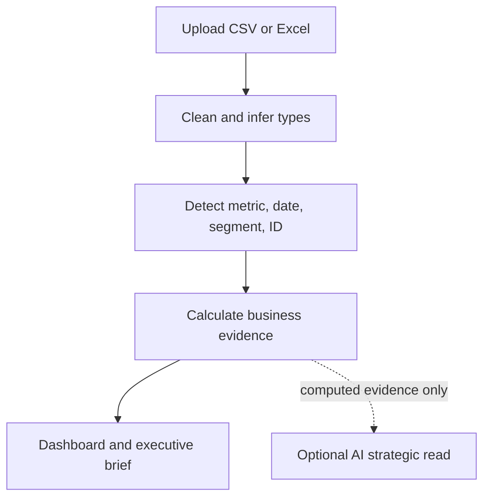

# ADA — AI-powered business intelligence from CSV and Excel

[](https://github.com/saineshnakra/automated-data-analyst/actions/workflows/ci.yml)
[](https://automated-data-analyst.streamlit.app/)
[](https://www.python.org/)
[](LICENSE)
[](CONTRIBUTING.md)

**Drop in a business file. Get a dashboard, the evidence behind it, and the next action.**

[Try the live dashboard](https://automated-data-analyst.streamlit.app/) · [See the roadmap](ROADMAP.md) · [Contribute](CONTRIBUTING.md) · [Report a bug](https://github.com/saineshnakra/automated-data-analyst/issues/new?template=bug_report.yml)


ADA is an open-source automated data analyst for operators who need answers without configuring a BI tool. Upload a CSV, XLSX, or XLSM file and ADA cleans it, detects its business schema, creates an interactive Plotly dashboard, explains material changes, and recommends what to investigate next.

It is designed for the simple use case analytics software often makes difficult: **even a first-time user should be able to upload a spreadsheet and understand what is happening in the business.**

## Why ADA is different

Most CSV analyzers stop at charts. ADA keeps three layers explicit:

| Layer | What it does | Trust boundary |
|---|---|---|
| **Calculation** | Detects trends, drivers, concentration, relationships, exceptions, and data quality | Deterministic and traceable |
| **Interpretation** | Turns those calculations into prioritized investigations | Clearly labeled; never causal proof |
| **Optional AI strategy** | Connects computed evidence into a concise strategic read | Opt-in; raw uploaded rows are not sent |

Every evidence card exposes its calculation. The deterministic dashboard remains authoritative whether or not the optional strategy model is configured.

## From spreadsheet to decision



ADA automatically looks for:

- A primary outcome such as revenue, sales, profit, cost, amount, or units
- A time field for period movement and current-versus-prior comparisons
- A useful segment such as product, category, channel, region, customer, or status
- Identifiers, missingness, outliers, concentration, and numeric relationships
- The strongest evidence-backed next investigation, separated from observed fact

If the source schema is unusual, users can override the detected metric, date, and segment without rebuilding the dashboard.

## Product capabilities

- Zero-configuration CSV and Excel analytics with an included synthetic demo
- Conservative cleanup, type inference, duplicate removal, and a visible cleaning audit
- Executive headline, four business KPIs, and plain-English briefing
- Automatically generated trend, contribution, distribution, and relationship charts
- Evidence ledger with the calculation behind every displayed signal
- Prioritized recommendations linked to deterministic evidence
- Optional structured strategy synthesis using the OpenAI Responses API
- Downloadable Markdown executive brief and cleaned CSV
- Responsive Streamlit interface built for non-technical users
- File limit and row cap for predictable hosted performance

## Privacy and model design

ADA works fully without an API key. In deterministic mode, no model call is made.

When the optional strategy layer is enabled, ADA sends only the calculated schema, summaries, evidence cards, recommendations, and user-supplied context. **It does not put uploaded rows into the model prompt.** The response must match a typed Pydantic schema, storage is disabled for the request, and a hashed anonymous session identifier is used for safety controls.

The default model is `gpt-5.6-luna` with low reasoning for an efficient strategic read. `gpt-5.6-terra` with medium reasoning is available when the decision is ambiguous enough to justify higher cost. Model calls are button-triggered and cached per evidence payload to avoid accidental spend.

See [SECURITY.md](SECURITY.md) for the complete data-handling and secret-management policy.

## Architecture

| Path | Responsibility |
|---|---|
| `app.py` | Thin Streamlit orchestration and session state |
| `pipeline.py` | Bounded preparation, cleaning, schema selection, and audit frames |
| `analysis.py` | Conservative cleaning and data profiling |
| `business_insights.py` | Schema detection, calculations, evidence, and deterministic recommendations |
| `ai_insights.py` | Optional typed Responses API synthesis over computed evidence |
| `ui.py` | Reusable presentation components and Plotly styling |
| `file_io.py` | Validated CSV and Excel parsing |
| `tests/` | Unit, privacy-contract, pipeline, business-logic, and rendering tests |

The codebase favors pure analysis functions and dependency injection at the model boundary. That keeps the business engine testable without Streamlit, network access, or API credits.

## Run locally

```bash
git clone https://github.com/saineshnakra/automated-data-analyst.git
cd automated-data-analyst
python -m venv .venv
source .venv/bin/activate  # Windows: .venv\Scripts\activate
python -m pip install -r requirements.txt
streamlit run app.py
```

No secret is required. A visitor can enter their own API key in the session-only sidebar field. A trusted private deployment can instead set `OPENAI_API_KEY` in the environment or in `.streamlit/secrets.toml`:

```toml
OPENAI_API_KEY = "your-key"
```

Never commit that file; it is already ignored. Avoid putting an owner-funded key on a public deployment unless you also add authentication and spending controls.

## Test and develop

```bash
python -m pip install -r requirements-dev.txt
ruff check .
python -m unittest discover -s tests -v
```

GitHub Actions runs linting, the complete test suite, and bytecode compilation on every push and pull request.

## Contribute

Contributions are welcome, especially around new deterministic metrics, schema-detection fixtures, chart accessibility, file formats, and adversarial test datasets. Start with [CONTRIBUTING.md](CONTRIBUTING.md), choose an item from the [roadmap](ROADMAP.md), or open a focused proposal.

Good contributions make an insight more accurate, more explainable, or easier for a non-technical user to act on. Every new recommendation should include a test and the calculation that supports it.

## Deploy

Deploy `app.py` on Streamlit Community Cloud. The repository includes its app theme, dependency manifest, server upload limit, and headless configuration. Add `OPENAI_API_KEY` through Streamlit's secret manager only if the optional strategy layer should be available.

## Author

Built and maintained by [Sainesh Nakra](https://sainesh.com/).

## License

[MIT](LICENSE)
