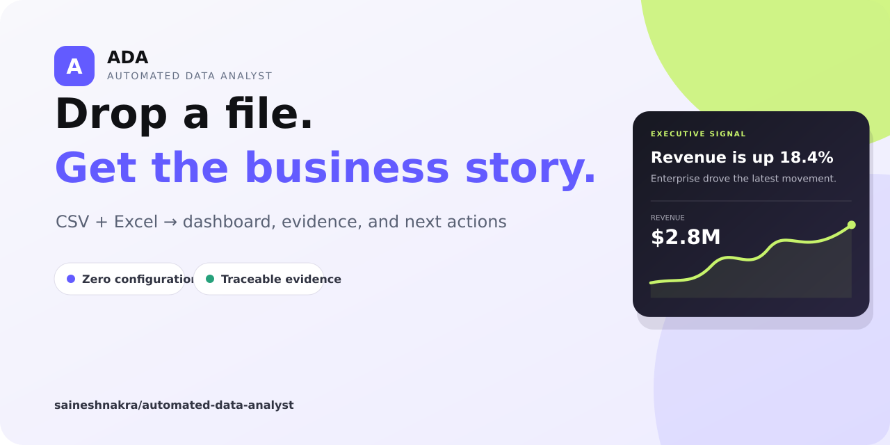
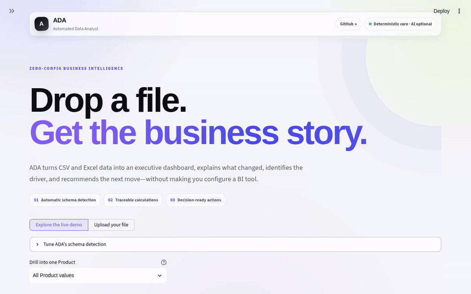
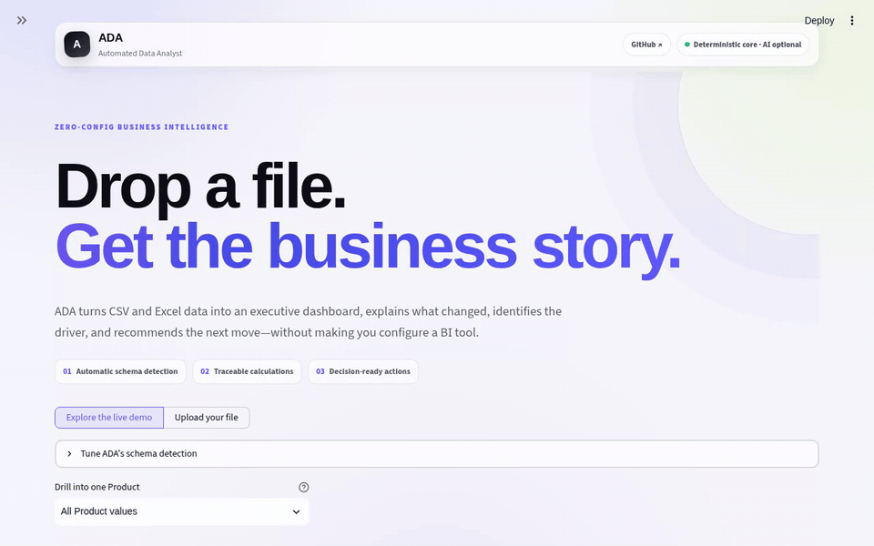

# ADA — Automated Data Analyst

[](https://github.com/saineshnakra/automated-data-analyst/actions/workflows/ci.yml)
[](https://www.python.org/)
[](LICENSE)

**Upload a CSV or Excel file. Get a dashboard, an executive brief, anomaly
flags, a forecast, and answers to plain-English questions — with the calculation
shown under every number.**

[Live demo](https://automated-data-analyst.streamlit.app/) ·
[Documentation](docs/README.md) ·
[Roadmap](ROADMAP.md) ·
[Contributing](CONTRIBUTING.md)



## What it does

ADA reads your file, works out which column is the metric, which is the date,
and which is the segment, then builds the analysis around that.

- **Dashboard** — trend, segment breakdown, movement waterfall, segment × period heatmap
- **Ask ADA** — plain-English questions answered locally with pandas, calculation shown
- **Anomaly flags** — periods outside a calibrated band, sized so a stable series false-alarms about once in twenty analyses
- **Forecast** — a guarded baseline that refuses to run on thin history and reports when it was no better than assuming no change
- **Evidence and next steps** — every finding carries its calculation; recommendations are labelled as interpretation, never as cause
- **Downloads** — Markdown executive brief and cleaned CSV

Limits: 25 MB per file, 250,000 rows analyzed. Formats: `.csv`, `.xlsx`, `.xlsm`.

### Nothing to upload? Try a sample

Pick **Try a sample dataset** in the app, or download one from [`samples/`](samples/):

| Sample | What it shows |
|---|---|
| [SaaS subscriptions](samples/saas-subscriptions.csv) | A real revenue drop the anomaly radar finds, and a forecast that beats no-change |
| [Support tickets](samples/support-tickets.csv) | No revenue column, and a forecast honest enough to say it is useless |
| [Ecommerce orders](samples/ecommerce-orders.csv) | Returns as negative rows, so totals cope with mixed signs |

All three are synthetic, so they carry no privacy or licensing baggage.

### Ask a business question. Get the number and its calculation.



### Focus on one segment. The whole analysis regroups.



<p align="center">
  
  
</p>

## Run it

```bash
git clone https://github.com/saineshnakra/automated-data-analyst.git
cd automated-data-analyst
python -m venv .venv
source .venv/bin/activate        # Windows: .venv\Scripts\activate
python -m pip install -r requirements.txt
streamlit run app.py
```

No API key required. The app opens with a built-in demo dataset.

## Does my data leave my machine?

No. Cleaning, schema detection, every chart, and every Ask ADA answer are
computed locally with pandas.

An optional AI layer adds two things when you supply a key: a query planner for
questions the rules cannot parse, and a strategic narrative. Both receive column
names, types, and already-computed evidence. **Neither receives your rows or
cell values.** Model-generated code is never executed.

Full details: [Privacy](docs/privacy.md) · [SECURITY.md](SECURITY.md)

## Documentation

| Page | What you get |
|---|---|
| [Concepts](docs/concepts.md) | The words ADA uses: measure, segment, period, evidence, plan |
| [How it works](docs/how-it-works.md) | Upload to dashboard, step by step |
| [Architecture](docs/architecture.md) | Which file does what, and why |
| [Reference](docs/README.md#reference) | One page per pipeline step |
| [Development](docs/development.md) | Setup, tests, CI, conventions |
| [FAQ](docs/faq.md) | Short answers to common questions |

For the design story behind the project, read
[I Built an AI Data Analyst That Tells You When It Hallucinates](https://medium.com/@saineshnakra/i-built-an-ai-data-analyst-that-tells-you-when-it-hallucinates-6051609c3f4a).

## Contributing

Good places to start: a new question shape for Ask ADA, a new deterministic
metric, schema-detection fixtures, chart accessibility, adversarial test data.

Read [CONTRIBUTING.md](CONTRIBUTING.md), browse the
[good first issues](https://github.com/saineshnakra/automated-data-analyst/labels/good%20first%20issue),
or pick something from the [roadmap](ROADMAP.md).

Every new recommendation needs a test and the calculation that supports it.

## License

[MIT](LICENSE)
