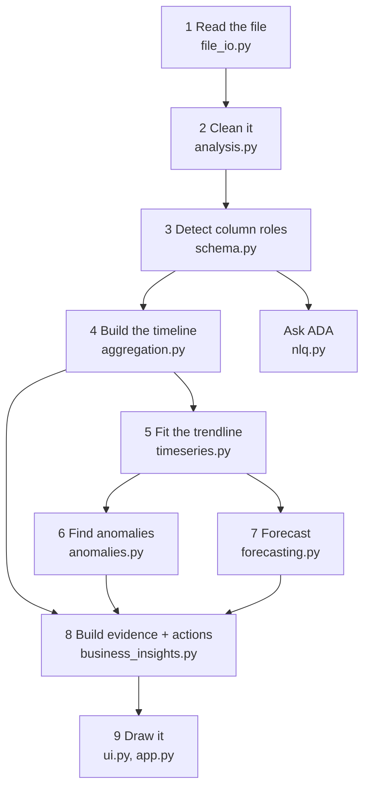
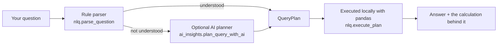

# How it works

The path from an uploaded file to a dashboard, in the order it actually happens.
Each step names the module that owns it, so you can jump straight to the code.

---

## 1. Read the file

**`file_io.py`** · [details](reference/reading-files.md)

Accepts `.csv`, `.xlsx`, and `.xlsm`. CSV delimiters are sniffed, so comma,
semicolon, and tab all work. If an Excel workbook has several sheets, you pick
one — ADA analyzes a single sheet at a time.

Two hard limits, both set in `app.py`:

- **25 MB** per file (`MAX_UPLOAD_BYTES`)
- **250,000 rows** analyzed (`MAX_ANALYSIS_ROWS`) — extra rows are dropped and
  the app says how many

## 2. Clean it

**`analysis.py` → `clean_dataframe`** · [details](reference/cleaning.md)

Conservative, reversible-in-spirit tidying: duplicate column names made unique,
fully empty rows and columns dropped, leftover "exported index" columns dropped,
text trimmed, and text columns converted to numbers or dates when nearly all
values convert cleanly.

Every change is counted in a `CleaningReport`, which the app shows as a cleaning
audit table. Nothing is silently altered.

## 3. Detect column roles

**`schema.py` → `detect_roles`** · [details](reference/schema-detection.md)

Picks the measure, date, segment, and identifier using column names, data types,
and how many distinct values each column has. No single signal is trusted alone.

You can override any of these in the app's "Tune ADA's schema detection" panel
without rebuilding anything.

## 4. Build the timeline

**`aggregation.py`** · [details](reference/periods.md)

This is the only place in the codebase that decides what a period is.

It chooses a grain (weekly, monthly, quarterly) from both the span of your dates
and how often rows are actually recorded, then totals the measure per period. It
excludes a trailing period the data only partly covers, and counts empty periods
as zero.

The result is a `TrendSeries`: the frame, the grain, and notes describing both
adjustments.

Other frames are built here too — segment totals, the movement waterfall, and
the segment × period heatmap.

## 5. Fit the trendline

**`timeseries.py`** · [details](reference/periods.md#the-trendline)

Fits a Theil–Sen line on calendar positions, and measures the typical spread of
the residuals robustly. Both anomaly detection and the forecast build on this
one fit, so they always agree about what "expected" means.

## 6. Find anomalies

**`anomalies.py`** · [details](reference/anomalies.md)

Flags periods that sit further from the trendline than a calibrated band.
Needs at least 8 periods. Reports the observed value, the expected value, the
expected range, and how far out it was.

## 7. Forecast

**`forecasting.py`** · [details](reference/forecasting.md)

Extends the trendline forward, optionally with month-of-year seasonality. Needs
at least 8 periods, never forecasts further than half the history you have, and
ships with a backtest that says outright when the forecast was no better than
assuming nothing changes.

If history is too thin, it returns nothing rather than guessing.

## 8. Build evidence and recommendations

**`business_insights.py` → `analyze_business`** · [details](reference/evidence.md)

Assembles the `BusinessBrief`: a headline, four KPIs, up to six evidence cards,
and prioritized recommendations.

Evidence kinds: `trend`, `driver`, `leader`, `concentration`, `anomaly`,
`relationship`, `outliers`, `quality`. Each carries its own calculation string.

## 9. Draw it

**`ui.py`** renders components and styles the Plotly charts.
**`app.py`** wires the Streamlit page together and holds session state.
**`pipeline.py`** sits between them, bundling steps 1–3 into one call and
handling drill-down.

Neither `ui.py` nor `app.py` calculates anything. That is a rule, not a habit —
see [Architecture](architecture.md).

---

## The Ask ADA path

Questions do not go through the dashboard pipeline. They take their own route,
starting from the same cleaned data and detected roles.

The AI planner is a fallback only, it needs an API key, it sees column names and
types but never your rows, and its answers are badged in the interface. Both
paths end in the same local executor.

Details: [Ask ADA](reference/ask-ada.md).
